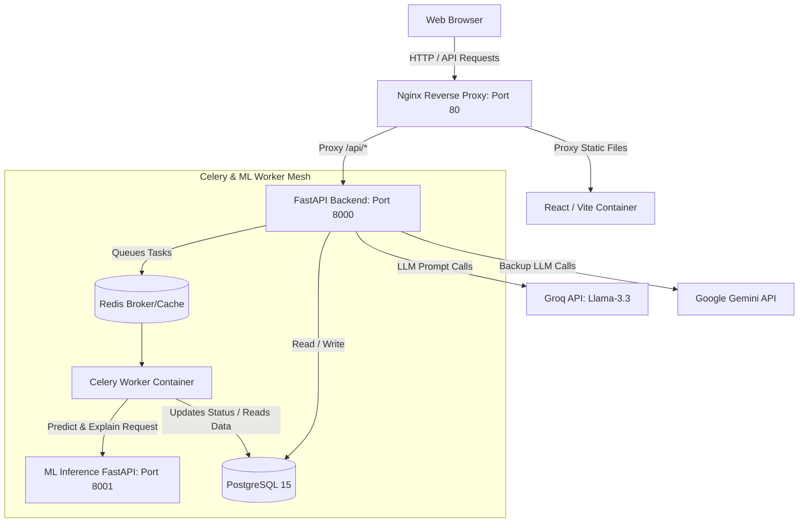

# 🗺️ PathPilot — AI-Powered Career Execution OS

[](https://opensource.org/licenses/MIT)
[](https://www.python.org/)
[](https://react.dev/)
[](https://www.docker.com/)

PathPilot is an industry-grade, intelligent career guidance platform that integrates **psychometric assessments**, **machine learning-based career matching**, **generative learning roadmaps**, and **gamified task execution** into a single cohesive operating system. It features **full multi-lingual support** (English, Hindi, Marathi) with real-time, on-the-fly AI translation.

---

## 🚀 Quick Start (Production-Ready Dev Environment)

### 📋 Prerequisites
* [Docker Desktop](https://www.docker.com/products/docker-desktop/) installed, running, and configured with Linux containers.

### 🔌 Run Using One-Click Launchers
We provide zero-configuration interactive scripts to boot the entire multi-service mesh:

* **Windows Users:** Double-click `start.bat`
* **macOS / Linux Users:** Run:
  ```bash
  chmod +x start.sh
  ./start.sh
  ```

The launcher will verify your Docker daemon, copy environment variables, prompt you interactively for API keys (optional), start the services, wait for database migrations/ML models to initialize, and launch your browser.

### 🌐 Exposed Services

Once booted, the application is reverse-proxied through Nginx:

| Service | Port | Endpoint |
|---|---|---|
| **PathPilot UI** | `80` (Standard HTTP) | [http://localhost](http://localhost) |
| **Backend Swagger Docs** | `8000` | [http://localhost:8000/api/v1/docs](http://localhost:8000/api/v1/docs) |
| **Backend Health Check** | `8000` | [http://localhost:8000/health](http://localhost:8000/health) |
| **ML Service Docs** | `8001` | [http://localhost:8001/docs](http://localhost:8001/docs) |

---

## 🛠️ Complete Technical Stack

PathPilot is designed as a modular, decoupled microservice mesh.

### 1. Frontend Client
* **Core Framework:** React 18 SPA built with Vite for optimal HMR.
* **Styling & Icons:** Modern custom UI components styled with Vanilla CSS and enriched with Lucide React icons.
* **Internationalization:** `react-i18next` for localization, syncing seamlessly with backend LLM translators.
* **Routing & State:** React Router DOM (v6), React Context API for global Authentication and Mentor Chat state.

### 2. Core API Backend
* **Web Framework:** FastAPI (Python 3.11) utilizing asynchronous request handling (`async/await`).
* **ORM & Database Layer:** SQLAlchemy 2.0 (using `asyncpg` driver) for PostgreSQL connections.
* **Migrations:** Alembic for automatic schema versioning and deployments.
* **Security:** JWT (JSON Web Tokens) with HS256 encryption, secure hashing via `passlib[bcrypt]`.

### 3. Machine Learning Microservice
* **Framework:** FastAPI (Python 3.11).
* **Algorithms:** Heterogeneous ML Ensemble containing **XGBoost**, **Gradient Boosting**, **Support Vector Machines (SVM)**, and a **Soft-Voting Classifier** to match users to 15+ potential career trajectories.
* **Interpretability:** Integrated SHAP (SHapley Additive exPlanations) values to explain *why* the models selected a specific career.

### 4. Asynchronous Task Broker & Workers
* **Distributed Task Queue:** Celery 5.3 manages resource-heavy processes.
* **Broker & Cache:** Redis 7.0 coordinates Celery messages, handles route rate-limiting, and serves as an execution cache.

---

## 🏗️ System Architecture



---

## 🌟 Highlighted Core Features

### 🌐 Real-Time On-The-Fly AI Translation
To make PathPilot fully multilingual, static assets are localized on the frontend using i18n dictionary resources, while **dynamic user-generated roadmaps and career profiles are translated on-the-fly at the API router layer**. When a user requests Marathi (`mr`) or Hindi (`hi`), the backend intercepts the payload, communicates with Groq using structural translation prompts, and returns localized JSON profiles.

### 🧠 Adaptive Learning Engine
A background Celery monitor runs a periodic user velocity check. If a user is struggling or inactive for 4 days, the adaptive pipeline automatically updates their roadmap difficulty settings, slicing task execution requirements and lowering parameters to prevent learning churn.

### 🧩 Hybrid AI Mentor Chat
The chat system uses custom intent parsing. If a user explores a career, rejects a suggestion, or completes a milestone, the state changes inside PostgreSQL (`UserDecisionState` tables) and prompts are dynamically modified to prevent the LLM from suggesting blacklisted options.

---

## ⚙️ Development Setup (Without Docker)

If you wish to run the services bare-metal on your host machine for debugging:

### 1. Database & Cache
Install and start **PostgreSQL** and **Redis** on your local machine. Create a database named `pathpilot`.

### 2. Run Backend & Celery Worker
```bash
cd backend
python -m venv .venv
source .venv/bin/activate  # On Windows: .venv\Scripts\activate
pip install -r requirements.txt
cp .env.example .env       # Edit configuration and add API keys
alembic upgrade head
uvicorn app.main:app --reload --port 8000
```
In a new terminal (with `.venv` activated):
```bash
celery -A app.worker.celery_app worker --loglevel=info
```

### 3. Run ML Inference Service
```bash
cd ml-service
python -m venv .venv
source .venv/bin/activate  # On Windows: .venv\Scripts\activate
pip install -r requirements.txt
uvicorn main:app --reload --port 8001
```

### 4. Run Frontend Client
```bash
cd frontend
npm install
npm run dev                # Dev server opens on http://localhost:5173
```

---

## 🔧 Maintenance & Extension

### Retraining the Career Matching Models
1. Navigate to the `ml-service/` directory.
2. Edit or replace the dataset `ml-service/data/careers.json`.
3. Activate your virtual environment and run the training pipeline:
   ```bash
   python scripts/train_model.py
   ```
4. The script will automatically retrain all models, generate new `.joblib` binary artifacts, and export a updated `metadata.json` mapping. Overwrite these into `ml-service/models/`.
5. Rebuild your Docker containers to reload the models.

---

## 🏁 Verification Checklist

After running `docker compose up --build`, you can verify the deployment integrity:
* [x] **Frontend Connection:** [http://localhost](http://localhost) loads the landing page.
* [x] **User Auth:** Creating a new account successfully redirects to the dashboard.
* [x] **Assessment Pipeline:** Submitting the form initiates polling and redirects to results.
* [x] **ML Inference:** Real career scores and SHAP graphs display on the results dashboard.
* [x] **Celery Worker:** Asynchronous tasks execute without raising connection errors in logs.
* [x] **API Resilience:** [http://localhost:8000/health](http://localhost:8000/health) returns `{"success": true}`.
